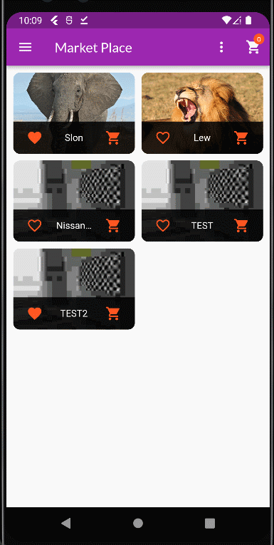
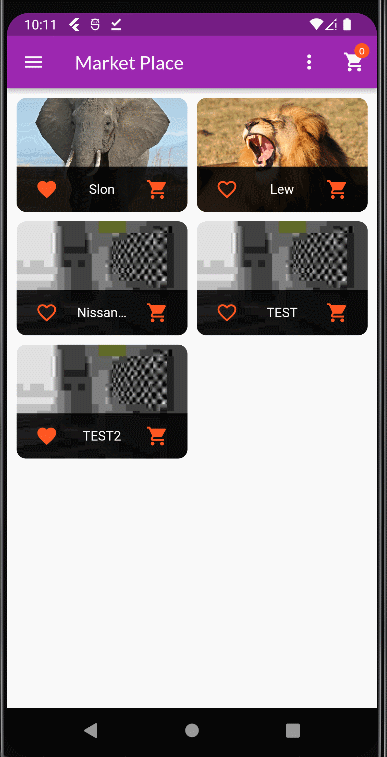

# shop_app

This is the application that, after adding a few features, can be used to sell products added by users.  It was written in the **Flutter** framework and it saves the data of products, orders and users in **Firebase**.

## Table of Contents
* [App Features](#app-features)
* [Presentation](#presentation)
* [Packages used in project](#packages-used-in-project)
* [Project Status](#project-status)
* [Sources](#sources)
* [Contact](#contact)

## App Features
- Sign Up by Email, Password and Username. 
- Login Using Email and Password. 
- View all user products.<b
- Adding products to favorites. 
- Adding products by user. 
- Ability for users to edit added products (delete and update). 
- Adding products to your cart. 
- Placing orders.  

## Presentation

> Login and Sign Up Screen. Overview Screen with the ability to add products to favorites, filter the display, and a screen with product details.

>Adding a product to the cart, undoing an added product. Order placement screen and screen with placed orders.
>

>Ekran edycji produktów użytkownika. Dodawanie, usuwanie i update produktów. Wylogowanie użytkownika.

## Packages used in project:
- [Provider](https://pub.dev/packages/provider)
- [Firebase Core](https://pub.dev/packages/firebase_core)
- [Firebase Auth](https://pub.dev/packages/firebase_auth)
- [Firebase Storage](https://pub.dev/packages/firebase_storage)
- [Cloud Firestore](https://pub.dev/packages/cloud_firestore)
- [Path Provider](https://pub.dev/packages/path_provider)
- [Image Picker](https://pub.dev/packages/image_picker)
- [Intl](https://pub.dev/packages/intl)
- [Http](https://pub.dev/packages/http)
- [Shared Preferences](https://pub.dev/packages/shared_preferences)
  

## Project Status
The project is a work in progress. I need to add the ability to edit products in the shopping cart, payment method, shipping method when placing an order and many other features to simplify ordering.

## Sources
The application was created during the course Flutter & Dart - The Complete Guide [2022 Edition] by Maximilian Schwarzmüller from Academind. On my own, I change the method of adding a picture. Storage in Firebase instead of writing the URL address of a photo.

## Contact
Created by [@dbrzek](mailto:brzek.damian@gmail.com) - feel free to contact me!
